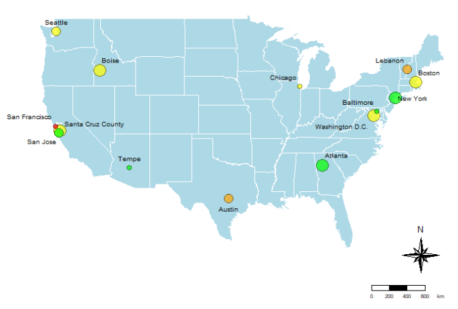

# AI Policy Analysis for Local Governments 

Cities are beginning to grapple with the introduction and prevalence of Artificial Intelligence (AI)
in governance, the workforce, and the daily lives of citizens. Technological advancements such
as AI continue to shape how society functions, and in turn how cities manage both day-to-day
and long-term operations. Our analysis of Artificial Intelligence (AI) policies and documentation
serves to take a look at preliminary trends in the policymaking space at the municipal level. 

The on-going research efforts include three goals: 

* Collect local governments' AI policies and adoption examples (e.g., AI chatbots) 
* Develop a web map that serves as a central repository for local governments' AI policy and adoption sharing. 
* Explore methods to systematically track and update policies and adoption examples over time and metrics as benchmarks for intercity comparisons   

## Documents and Citations 

These research documents are preliminary insights. Please use with discretion and share with credits. 

Mozaffar, E., Suri, A., Liang, X. An Analysis of Municipal-Level AI Governance in the United States. Presentation at MetroLab's GenAI Taskforce for Local Governments. July 19th, 2024. [Presentation Slides](https://docs.google.com/presentation/d/1R9dAR822GjMtB4PkBa2BTBsEoSOaZF32eocDymfIlJI/edit?usp=sharing). 

Mozaffar, E., Suri, A., Zhang, E. AI Governance: Analyzing City-Level Artificial Intelligence Policies in the United States. May, 2024. **[Report PDF](). [Data Table](https://docs.google.com/spreadsheets/d/1ws11lKcjLwduc4POXvYId5n0Zabt0jq0/edit?gid=906111947#gid=906111947). [Interactive Map](https://rpubs.com/estellaz/AIPoliciesUS)**. 

## Team 

The current project team includes 

* [Prof. Xiaofan Liang](https://xiaofanliang.com/), Assistant Professor of Urban and Regional Planning, Taubman College of Architecture and Urban Planning, University of Michigan.
* [Eman Mozaffar](https://www.linkedin.com/in/emanmozaffar/), M.S. in Data Science, School of Information, University of Michigan
* [Arjun Suri](https://www.linkedin.com/in/arjuns1/), B.S. in Urban Technology, Taubman College of Architecture and Urban Planning, University of Michigan

This project originated from a final project from Prof. Xiaofan Liang's Introduction to Urban Informatics class at the University of Michigan. 

## Collaboration 

Prof. Xiaofan Liang is developing more projects surrounding socially and ethically responsible design of AI in public services, especially with regards to appliations of AI in urban planning and city services that enhance civic participation. We are looking for municipal and academic partner for this line of work. If you are interested in this AI policy project or other related topics as stated above. Please reach out to xfliang@umich.edu for conversations. 

## Acknowledgement 

We would like to thank MetroLab for research support and Estella Zhang Qiming who contributed to the original final project. 

